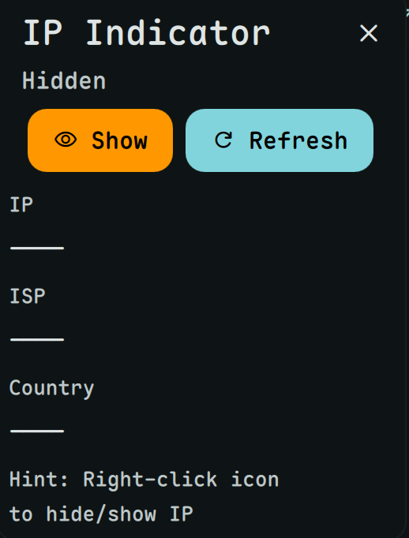

# IP Indicator

Display your public IP, ISP, and location.



## Install


**Required:** This plugin requires [dms-common](https://github.com/hthienloc/dms-common) to be installed.

```bash
# 1. Install shared components
git clone https://github.com/hthienloc/dms-common ~/.config/DankMaterialShell/plugins/dms-common

# 2. Install this plugin
dms://plugin/install/ipIndicator
```

Or manually:
```bash
git clone https://github.com/hthienloc/dms-ipIndicator ~/.config/DankMaterialShell/plugins/ipIndicator
```

## Features

- **IP info at a glance** - Country flag, IP address, ISP
- **Privacy mode** - Right-click to hide/show IP
- **Auto-refresh** - Fetch on startup

## Usage

| Action | Result |
|--------|--------|
| Left click | Open details popout |
| Right click | Toggle privacy mode |

## Requirements

- `curl` - HTTP requests to ip-api.com

## License

GPL-3.0

## Roadmap / TODO
- [ ] **VPN Status Detection**: Indicate whether a VPN is active by checking for common VPN interfaces (tun0, wg0) or known VPN IP ranges.
- [ ] **Network Latency Tool**: Add a real-time ping indicator to monitor connection stability to reliable servers (e.g., 1.1.1.1).
- [ ] **IP History Log**: Implement a local history log to track when and how your public IP or ISP has changed over time.
- [ ] **Multi-Provider Fallback**: Add support for multiple IP-API providers to ensure reliability if one service is down.
